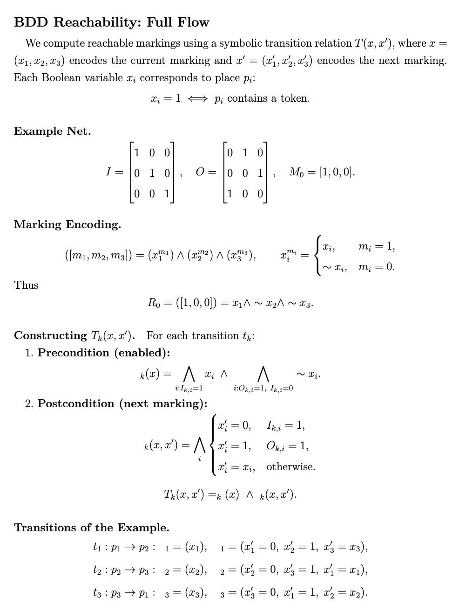
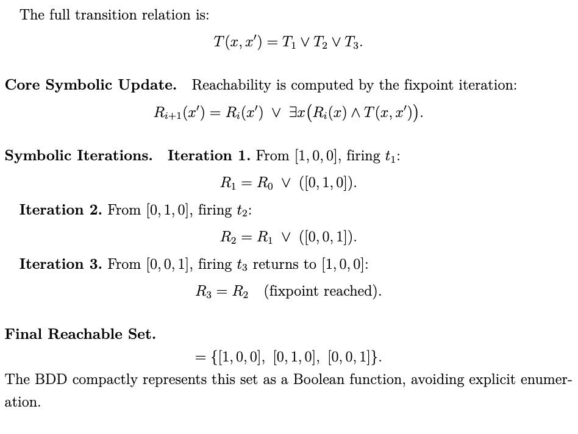
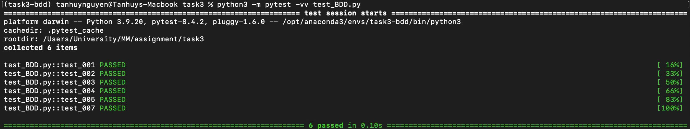
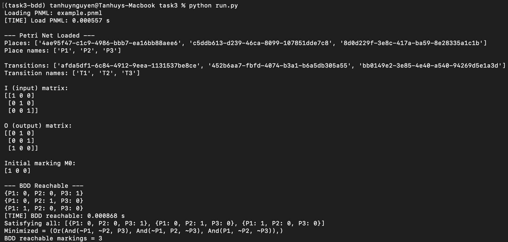

# TASK 3 BTL MHH

**Symbolic computation of reachable markings by using BDD:** Encode markings
symbolically using Binary Decision Diagrams (BDDs). Construct the reachability set
iteratively by symbolic image computation. Return a BDD representing the set of all
reachable markings. Report the total number of reachable markings and compare perfor-
mance with the explicit approach (time and memory)

## Requirements

- Set up (virtual environment)
```
python3 -m venv venv
```

- Acitvate virtual envirnment
```
# Windows
venv\Scripts\Activate.ps1

# Linux / macOS:
source venv/bin/activate
```

- Install library vie `requirements.txt`
```
pip install -r requirements.txt
```
##  Visualization 
<p align="center">
  
</p>
<p align="center">
  
</p>


##  Running tests

- Run all tests
```
python3 -m pytest -vv test_BDD.py
```
<p align="center">
  
</p>
## Run a procedure

```
python run.py
```
<p align="center">
  
</p>

