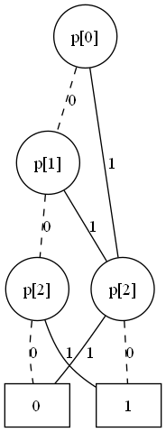
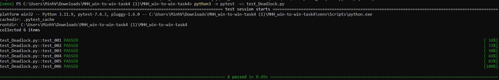
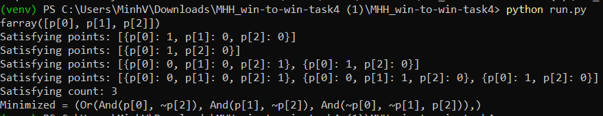

# TASK 4 BTL MHH

**Deadlock detection by using ILP and BDD:** Combine ILP formulation and the
BDD obtained in Task 3 to detect a deadlock if it exists. More specifically, output one
deadlock if found, otherwise report none. Note that a dead marking is a marking where
no transition is enabled, whereas a deadlock is a dead marking that is reachable from the
initial marking [17]. Report the running time on some example models.

## Requirements

- Create a virtual environment
```
python3 -m venv venv
```

- Activate the virtual environment
```
# Windows
venv\Scripts\Activate.ps1

# Linux / macOS:
source venv/bin/activate
```

- Install required libraries from requirements.txt
```
pip install -r requirements.txt
```


##  Running tests

- Run all tests
```
python3 -m pytest -vv test_Deadlock.py
```

- Run a single test function

```
python3 -m pytest -vv test_Deadlock.py::test_001
```
## Running run.py
To generate the BDD visualization and the minimized Boolean expression, run:
```
python run.py
```
This file is used to visualize and analyze the logical structure of reachable markings.
## Output
<p align="center">
  
</p>

<p align="center">
  
</p>

<p align="center">
  
</p>
