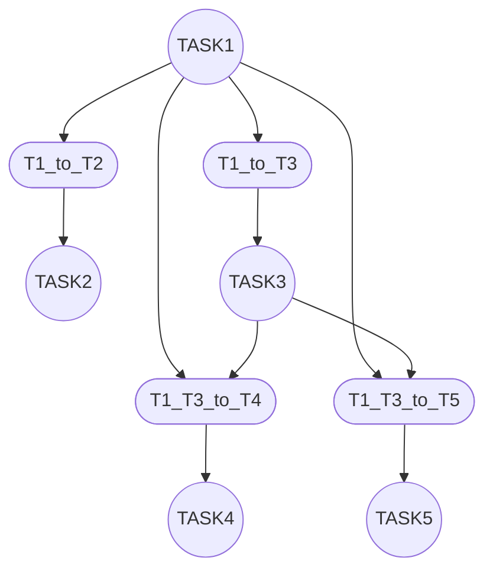

# Symbolic and Algebraic Reasoning in Petri Nets 



## Requirements

- Create virtual environment
```sh
python3 -m venv venv
```

- Activate virtual environment
```sh
# Windows
venv\Scripts\Activate.ps1

# Linux / macOS:
source venv/bin/activate
```

- Install required library from `requirements.txt`
```sh
pip install -r requirements.txt
```

## Running Code

```sh
python run.py
```

##  Running tests

- Run all tests
```sh
python -m pytest tests/ -v
```
(I want to add run_test_all.png picture)

- Run a single test File (PetriNet)

```sh
python -m pytest tests/test_petriNet.py -v
```

- Run a single test File (BDD)

```sh
python -m pytest tests/test_BDD.py -v
```