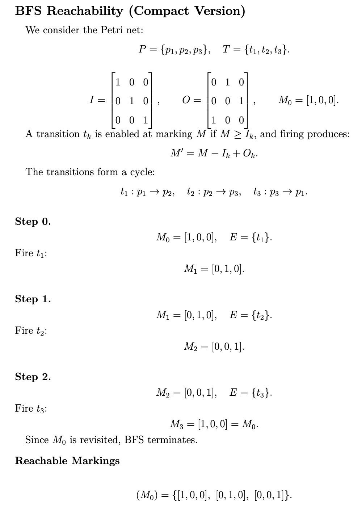

# TASK 2 BTL MHH

**Explicit computation of reachable markings:** Implement a basic breadth-first search
(BFS) algorithm to enumerate all reachable 1-safety markings starting
from the initial marking.

## Requirements

- Create virtual environment
```
python -m venv venv
```

- Activate virtual environment
```
# Windows
venv\Scripts\Activate.ps1

# Linux / macOS:
source venv/bin/activate
```

- Install required library from `requirements.txt`
```
pip install -r requirements.txt
```
## Visualization
<p align="center">
  
</p>


##  Running tests

- Run run.py
```
python run.py
```
<p align="center">
  
</p>

- Run all BFS test

```
python -m pytest -vv test_BFS.py
```
<p align="center">
  
</p>

- Run a single BFS test
```
python -m pytest -vv test_BFS.py::test_001
```
<p align="center">
  
</p>
